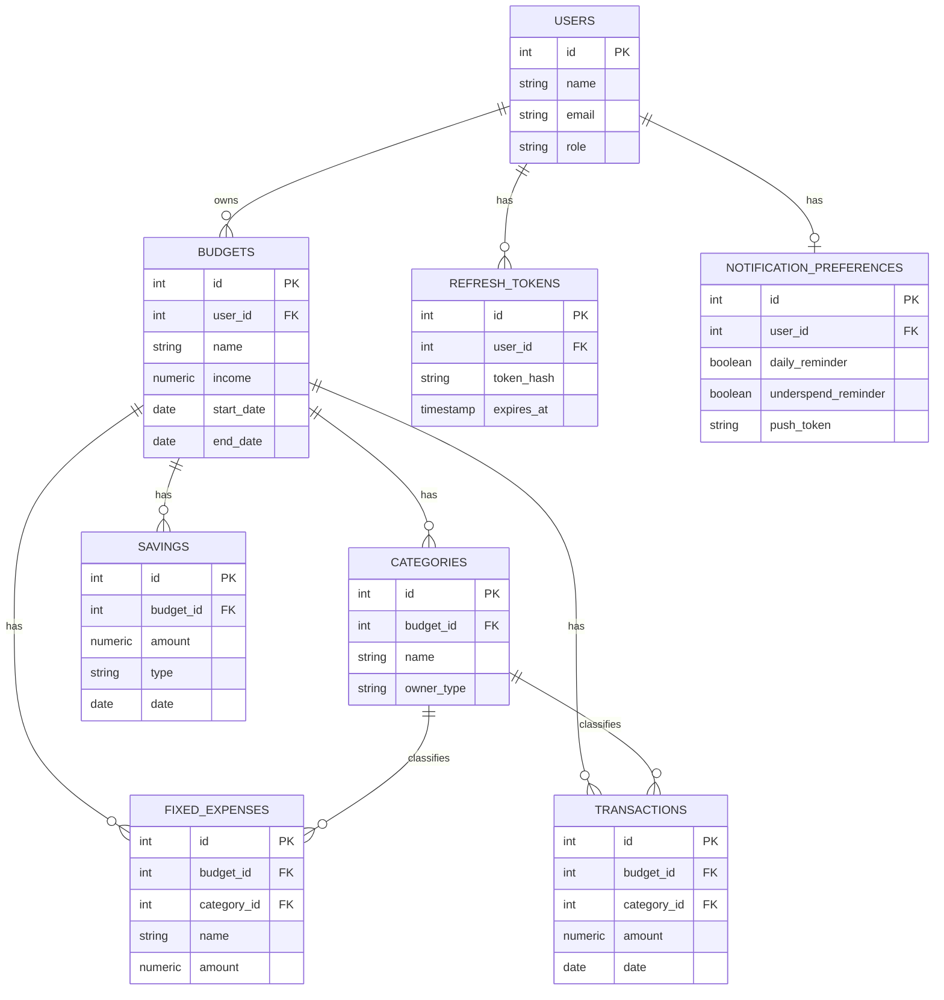

# Budget Tracker — Entity Relationship Diagram

This renders automatically if viewed on GitHub, GitLab, or any Markdown
viewer with Mermaid support. If viewing elsewhere, paste the code block
into the live editor at https://mermaid.live to see it rendered.

## Notes not visible in the diagram itself

- `users.role` is restricted to `USER`/`ADMIN` via a `CHECK` constraint,
  not a separate table.
- `categories` has `UNIQUE(budget_id, name)` — one name per budget.
- `fixed_expenses.category_id` and `transactions.category_id` both use
  `ON DELETE RESTRICT` — this is the mechanism that blocks deleting an
  in-use category.
- `notification_preferences` has a one-to-one relationship with `users`,
  enforced by `UNIQUE(user_id)`.

This matches `src/db/schema.sql` from the backend starter exactly.
